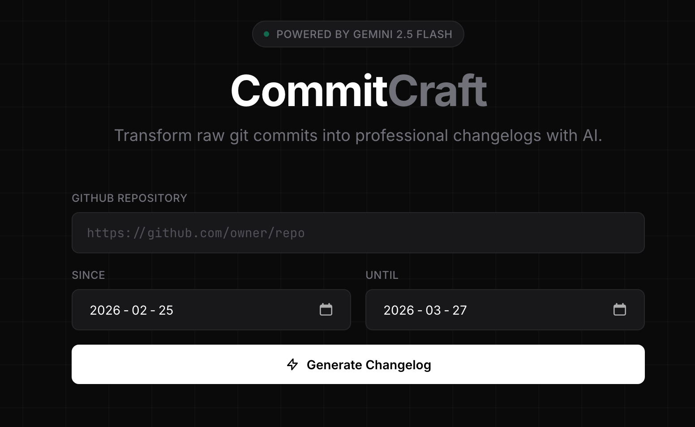

# CommitCraft

Transform raw git commit history into a clean, professional changelog using AI. Point it at any public GitHub repository, pick a date range, and get structured release notes in seconds.

**Live demo:** [commit-craft-hazel.vercel.app](https://commit-craft-hazel.vercel.app)



---

## How it works

1. Enter a public GitHub repo URL and a date range
2. The backend fetches all commits from the GitHub REST API
3. Commit messages are sent to **Google Gemini 2.5 Flash**
4. Gemini groups and rewrites them into a structured changelog
5. Results are displayed with category badges and a Copy to Markdown button

---

## Tech stack

| Layer    | Technology                           |
| -------- | ------------------------------------ |
| Frontend | React 18, Vite, Tailwind CSS         |
| Backend  | Python 3.9+, FastAPI, httpx          |
| LLM      | Google Gemini 2.5 Flash              |
| Data     | GitHub REST API (no auth required)   |
| Hosting  | Frontend → Vercel, Backend → Railway |

---

## Project structure

```
commitcraft/
├── backend/
│   ├── main.py           # FastAPI app — /generate endpoint
│   ├── requirements.txt
│   └── .env.example
├── frontend/
│   ├── src/
│   │   ├── App.jsx       # Full single-page UI
│   │   └── main.jsx
│   ├── index.html
│   ├── package.json
│   └── tailwind.config.js
└── README.md
```

---

## Running locally

### Prerequisites

- Python 3.9+
- Node.js 18+
- A Google Gemini API key — get one free at [aistudio.google.com](https://aistudio.google.com)

### Backend

```bash
cd backend

# Create and activate a virtual environment
python3 -m venv .venv
source .venv/bin/activate      # Windows: .venv\Scripts\activate

# Install dependencies
pip install -r requirements.txt

# Configure environment
cp .env.example .env
# Open .env and set GEMINI_API_KEY=your_key_here

# Start the server
uvicorn main:app --reload --port 8000
```

API available at `http://localhost:8000` — interactive docs at `http://localhost:8000/docs`

### Frontend

```bash
cd frontend
npm install
npm run dev
```

Open `http://localhost:5173` in your browser.
